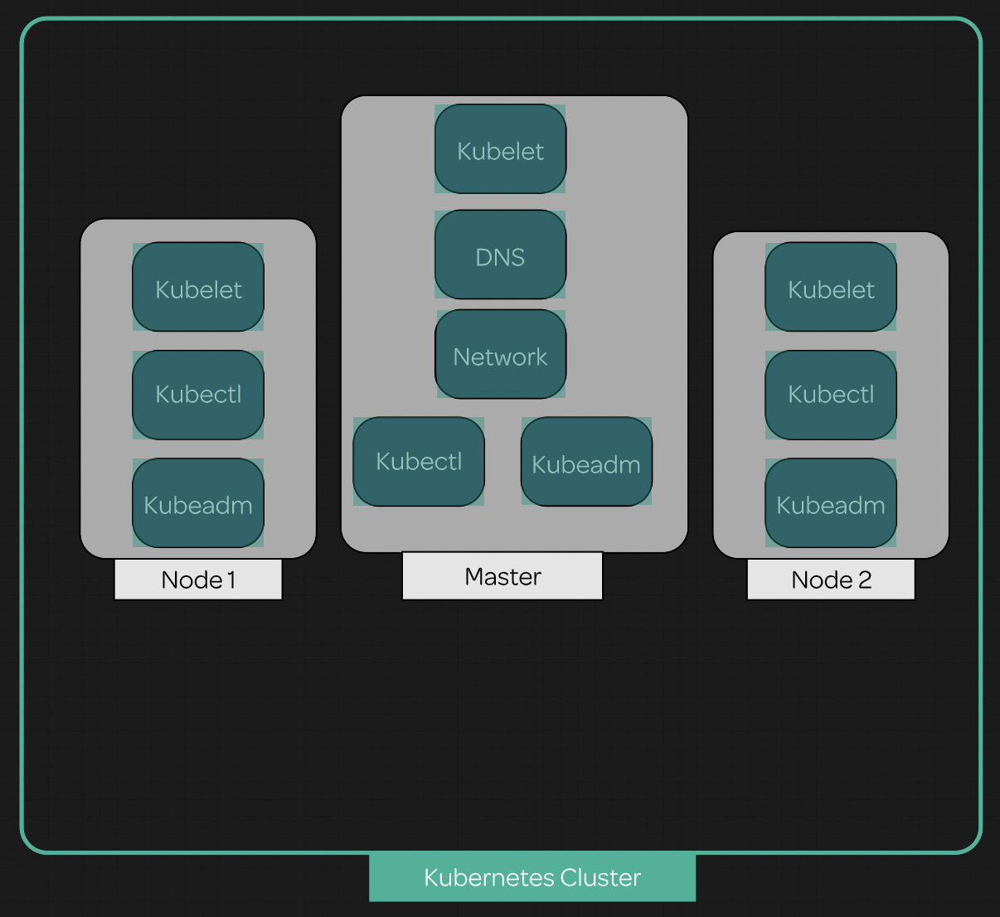

# learn-k8s

## Cluster diagram

## Terminology 
- Kubelet
    - The kubelet is the primary "node agent" that runs on each node. It can register the node with the apiserver using one of: the hostname; a flag to override the hostname; or specific logic for a cloud provider.
- kubectl
    - k8s command line tool
- kubeadm
    - Kubeadm is a tool built to provide kubeadm init and kubeadm join as best-practice "fast paths" for creating Kubernetes clusters

## Launch a k8s cluster
[Details](/lessons/install/index.md)